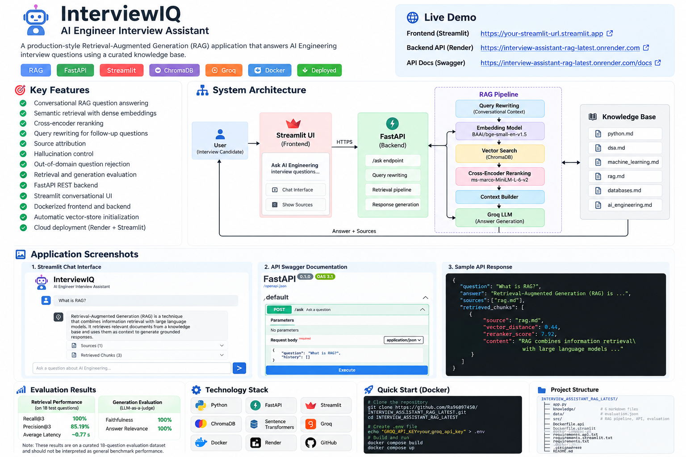

# InterviewIQ — AI Engineer Interview Assistant

InterviewIQ is an end-to-end **Retrieval-Augmented Generation (RAG)** application designed to answer AI Engineering interview questions using a curated knowledge base.

The project demonstrates a complete production-style RAG workflow including document ingestion, chunking, embeddings, vector search, cross-encoder reranking, conversational query rewriting, grounded generation, evaluation, REST APIs, Docker, and cloud deployment.

---
## Project Overview



## Live Application

**Frontend:**  
https://interviewassistantraglatest-d39gzk4c7tsf6t8rxngkg4.streamlit.app/

**Backend API:**  
https://interview-assistant-rag-latest.onrender.com

**Swagger API Docs:**  
https://interview-assistant-rag-latest.onrender.com/docs

---

# Features

- Conversational RAG question answering
- Semantic retrieval using dense embeddings
- Persistent vector storage using ChromaDB
- Cross-encoder reranking
- Query rewriting for follow-up questions
- Source attribution
- Hallucination control
- Out-of-domain question rejection
- Retrieval evaluation
- Generation evaluation
- FastAPI REST backend
- Streamlit conversational UI
- Dockerized frontend and backend
- Automatic vector-store initialization
- Cloud deployment

---

# Supported Knowledge Areas

InterviewIQ currently contains curated knowledge for:

- Python
- Data Structures & Algorithms
- Machine Learning
- Retrieval-Augmented Generation
- Databases
- AI Engineering

Example questions:

```text
What is RAG?

How does gradient descent update model weights?

How does database indexing work?

What is a Python generator?

How does the sliding window technique work?

Why does it reduce the loss?
```

The final question demonstrates conversational query rewriting, where the system uses chat history to understand that **"it" refers to gradient descent**.

---

# Architecture

```text
                        User
                         │
                         ▼
                ┌─────────────────┐
                │   Streamlit UI  │
                └────────┬────────┘
                         │
                         │ HTTPS
                         ▼
                ┌─────────────────┐
                │     FastAPI     │
                └────────┬────────┘
                         │
                         ▼
                ┌─────────────────┐
                │ Query Rewriting │
                └────────┬────────┘
                         │
                         ▼
                ┌─────────────────┐
                │ Query Embedding │
                └────────┬────────┘
                         │
                         ▼
                ┌─────────────────┐
                │    ChromaDB     │
                │ Vector Retrieval│
                └────────┬────────┘
                         │
                         ▼
                ┌─────────────────┐
                │  Cross Encoder  │
                │    Reranking    │
                └────────┬────────┘
                         │
                         ▼
                ┌─────────────────┐
                │ Context Builder │
                └────────┬────────┘
                         │
                         ▼
                ┌─────────────────┐
                │    Groq LLM     │
                └────────┬────────┘
                         │
                         ▼
                 Answer + Sources
```

---

# RAG Pipeline

## 1. Document Ingestion

Markdown files from the `knowledge/` directory are loaded into the ingestion pipeline.

```text
knowledge/
├── python.md
├── dsa.md
├── machine_learning.md
├── rag.md
├── databases.md
└── ai_engineering.md
```

---

## 2. Chunking

Documents are split using paragraph-aware chunking.

The objective is to preserve semantic context while keeping chunks small enough for effective retrieval.

---

## 3. Embeddings

Chunks are converted into dense vector representations using:

```text
BAAI/bge-small-en-v1.5
```

Embedding dimension:

```text
384
```

---

## 4. Vector Database

Embeddings are stored inside:

```text
ChromaDB
```

The vector database is intentionally excluded from GitHub.

When the backend starts in a new environment, InterviewIQ automatically:

```text
Knowledge Base
      ↓
Document Loading
      ↓
Chunking
      ↓
Embedding Generation
      ↓
ChromaDB Initialization
```

This allows the application to deploy without committing generated database files.

---

## 5. Semantic Retrieval

The user's query is embedded and used to retrieve candidate chunks from ChromaDB.

A similarity-distance threshold helps reject unrelated questions.

For example, questions about Kubernetes can be rejected because Kubernetes is not part of the current knowledge base.

---

## 6. Cross-Encoder Reranking

Initial vector search is followed by a cross-encoder reranker:

```text
cross-encoder/ms-marco-MiniLM-L-6-v2
```

Vector retrieval provides efficient candidate discovery.

The cross-encoder then evaluates:

```text
Query + Candidate Chunk
```

together and produces a stronger relevance ranking.

---

## 7. Conversational Query Rewriting

InterviewIQ supports follow-up questions.

Example:

```text
User:
What is gradient descent?

User:
Why does it reduce the loss?
```

The query rewriting layer transforms the follow-up approximately into:

```text
Why does gradient descent reduce the loss?
```

This standalone question is then passed through the retrieval pipeline.

---

## 8. Grounded Generation

Retrieved context is provided to the LLM through a controlled prompt.

The LLM is instructed to answer using only retrieved context.

If sufficient information cannot be found, InterviewIQ responds with:

```text
I don't have enough information in the knowledge base.
```

This reduces hallucinations.

---

# Evaluation

The system includes automated retrieval and generation evaluation.

## Retrieval Evaluation

Evaluation dataset:

```text
18 questions
```

Results:

```text
Recall@3        : 100%
Precision@3     : 85.19%
Average Latency : ~0.77 seconds
```

These metrics were measured on the project's curated 18-question evaluation dataset and should not be interpreted as general benchmark performance.

---

## Generation Evaluation

LLM-as-a-judge evaluation measures:

- Faithfulness
- Answer relevance

Results on the current evaluation dataset:

```text
Faithfulness     : 100%
Answer Relevance : 100%
```

---

# Technology Stack

## Backend

```text
Python
FastAPI
Uvicorn
Groq API
```

## RAG / AI

```text
Sentence Transformers
BAAI/bge-small-en-v1.5
CrossEncoder
ChromaDB
Groq LLM
```

## Frontend

```text
Streamlit
```

## Infrastructure

```text
Docker
Docker Compose
GitHub
Render
Streamlit Community Cloud
```

---

# Project Structure

```text
INTERVIEW_ASSISTANT_RAG_LATEST/
│
├── app.py
│
├── knowledge/
│   ├── ai_engineering.md
│   ├── databases.md
│   ├── dsa.md
│   ├── machine_learning.md
│   ├── python.md
│   └── rag.md
│
├── data/
│   └── evaluation.json
│
├── src/
│   ├── api.py
│   ├── chunking.py
│   ├── embeddings.py
│   ├── evaluate.py
│   ├── evaluate_generation.py
│   ├── ingestion.py
│   ├── rag.py
│   ├── retriever.py
│   └── vector_store.py
│
├── Dockerfile.api
├── Dockerfile.streamlit
├── docker-compose.yml
│
├── requirements.api.txt
├── requirements.streamlit.txt
├── requirements.txt
│
├── .dockerignore
├── .gitignore
└── LICENSE
```

---

# Local Setup

Clone the repository:

```bash
git clone https://github.com/Ra96097450/INTERVIEW_ASSISTANT_RAG_LATEST.git
```

Move into the project:

```bash
cd INTERVIEW_ASSISTANT_RAG_LATEST
```

Create a `.env` file:

```env
GROQ_API_KEY=your_groq_api_key
```

Never commit `.env` to GitHub.

---

# Run with Docker

Build the services:

```bash
docker compose build
```

Start the application:

```bash
docker compose up
```

Streamlit:

```text
http://localhost:8501
```

FastAPI:

```text
http://localhost:8000
```

Swagger:

```text
http://localhost:8000/docs
```

Check running containers:

```bash
docker compose ps
```

Stop the application:

```bash
docker compose down
```

---

# Run Without Docker

Install backend dependencies:

```bash
pip install -r requirements.api.txt
```

Start FastAPI:

```bash
uvicorn src.api:app --reload
```

Install frontend dependencies:

```bash
pip install -r requirements.streamlit.txt
```

Start Streamlit:

```bash
streamlit run app.py
```

---

# API Usage

Endpoint:

```text
POST /ask
```

Example request:

```json
{
  "question": "What is RAG?",
  "history": []
}
```

Example conversational request:

```json
{
  "question": "Why does it reduce the loss?",
  "history": [
    {
      "role": "user",
      "content": "What is gradient descent?"
    },
    {
      "role": "assistant",
      "content": "Gradient descent is an optimization algorithm..."
    }
  ]
}
```

Example response structure:

```json
{
  "question": "What is RAG?",
  "answer": "Retrieval-Augmented Generation...",
  "sources": [
    "rag.md"
  ],
  "retrieved_chunks": [
    {
      "source": "rag.md",
      "vector_distance": 0.44,
      "reranker_score": 7.92,
      "content": "..."
    }
  ]
}
```

---

# Docker Architecture

The application uses separate containers for the frontend and backend.

```text
Browser
   │
   ▼
Streamlit Container :8501
   │
   │ http://api:8000
   ▼
FastAPI Container :8000
   │
   ├── Query Rewriter
   ├── Embedding Model
   ├── ChromaDB
   ├── Cross Encoder
   └── Groq LLM
```

Docker Compose provides internal service discovery, allowing Streamlit to communicate with FastAPI using:

```text
http://api:8000
```

instead of localhost.

---

# Deployment

Production architecture:

```text
                     Internet
                        │
                        ▼
             Streamlit Community Cloud
                        │
                        │ HTTPS
                        ▼
                     Render
                        │
                   FastAPI API
                        │
                        ▼
                  RAG Pipeline
```

Environment secrets such as the Groq API key are configured through the deployment platform and are never committed to GitHub.

---

# Current Limitations

The current knowledge base is intentionally small and curated.

Future improvements could include:

- Larger document collections
- PDF ingestion
- Hybrid BM25 + vector retrieval
- Metadata filtering
- Persistent cloud vector database
- Redis caching
- Streaming responses
- Authentication
- Rate limiting
- Observability and tracing
- RAGAS-based evaluation
- CI/CD testing
- Automated ingestion pipelines
- User-uploaded document support

---

# What This Project Demonstrates

InterviewIQ demonstrates practical experience across the complete RAG lifecycle:

```text
Data
 ↓
Ingestion
 ↓
Chunking
 ↓
Embeddings
 ↓
Vector Database
 ↓
Semantic Retrieval
 ↓
Reranking
 ↓
Query Rewriting
 ↓
Prompt Engineering
 ↓
LLM Generation
 ↓
Evaluation
 ↓
FastAPI
 ↓
Streamlit
 ↓
Docker
 ↓
Cloud Deployment
```

The focus of the project is not only generating answers with an LLM, but designing, evaluating, containerizing, and deploying a complete retrieval-based AI system.

---

# Author

**Rajib Seakh**

AI Engineering | Python | RAG | Agentic AI | Backend Development